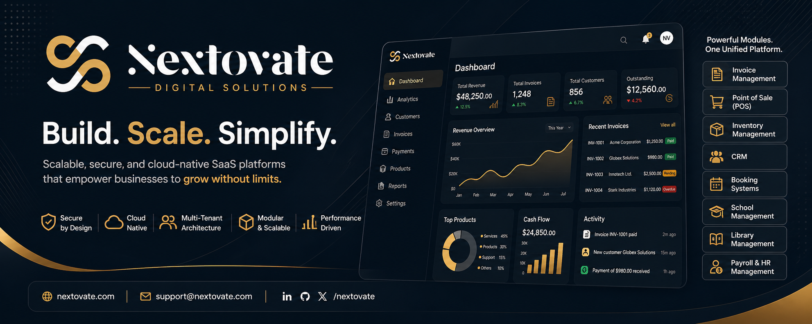

  

<h1 align="center">Nextovate Digital Solutions</h1>

  <i><b>Build. Scale. Simplify.</b></i> 
  Scalable, secure, cloud-native SaaS platforms for modern businesses

  
  
  
  

---

## 🌐 Who We Are

> **Nextovate** is a forward-thinking software company building **scalable, secure, and cloud-native SaaS platforms** for modern businesses.

We create **modular, enterprise-grade applications** that empower organizations to streamline operations, improve efficiency, and scale with confidence.

---

## ☁️ Platform

### ✨ Nextovate Cloud

A unified SaaS platform that delivers powerful business tools through a single ecosystem.

- 🏢 Multi-tenant architecture  
- 💳 Module-based subscriptions  
- ☁️ Cloud-native infrastructure  
- 🔐 Secure authentication & authorization  
- ⚡ Scalable and extensible design  

---

## 🧩 Product Ecosystem

Our platform is built around independent, scalable modules.

### 💼 Core Business Modules
- 📄 **Invoice Management** *(Ongoing)*  
- 🛒 **Point of Sale (POS)** *(Coming Soon)*  
- 📦 **Inventory Management** *(Coming Soon)*  
- 👥 **Customer Relationship Management (CRM)** *(Planned)*  
- 🏨 **Booking & Reservation Systems** *(Planned)*  

### 🏢 Industry Solutions
- 🎓 **School Management System** *(Planned)*  
- 📚 **Library Management System** *(Planned)*  
- 💰 **Payroll & HR Management** *(Planned)*  

> 💡 Each module can operate independently or integrate seamlessly within **Nextovate Cloud**.

---

## 🏗️ Architecture Principles

We follow enterprise-grade engineering standards:

- 🧠 **Multi-Tenant SaaS Architecture**  
- 🧩 **Modular System Design**  
- 🏛️ **Clean Architecture (Controller → Service → Repository)**  
- 🔗 **API-First Development**  
- ⚙️ **Microservices-Ready Structure**  

---

## 🔐 Security & Reliability

Security is embedded across every layer:

- 🔑 **JWT Authentication + Secure Cookies**  
- 🛡️ **Role-Based Access Control (RBAC)**  
- 🚦 **API Rate Limiting & Protection**  
- ✅ **Data Validation & Sanitization**  
- 🧯 **Protection against XSS, CSRF, and Injection**  

---

## 🚀 Vision

  <b>To build a unified SaaS ecosystem where businesses manage everything from a single cloud platform.</b>

---

## 🤝 Collaboration

We welcome developers, contributors, and partners to collaborate and build the future with us.

---

## 📫 Contact

- 🌐 Website: https://nextovate.com *(Coming Soon)*  
- 📧 Email: support@nextovate.com  

---

## 🏷️ Tagline

  <b>Nextovate</b> 
  Build. Scale. Simplify.

